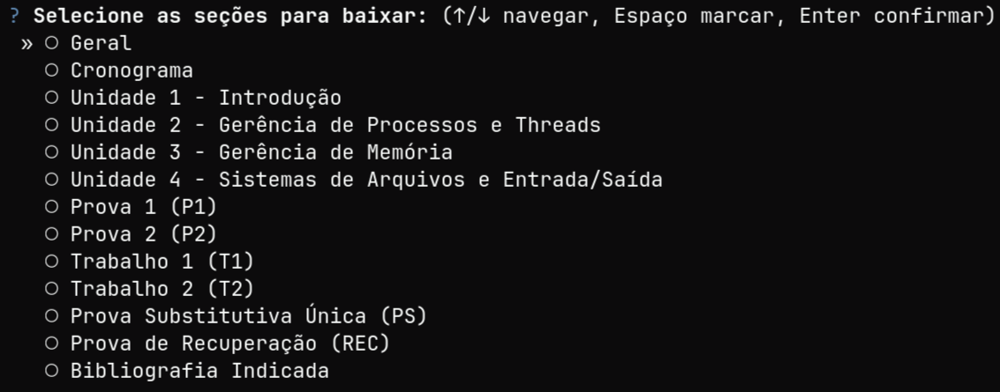

# cli-moodle-download

CLI para baixar os arquivos de uma ou mais seções de uma disciplina no Moodle
Presencial da UFSC.



## Instalação

1. Instale o [`uv`](https://docs.astral.sh/uv/getting-started/installation/)
   (Linux, macOS e Windows).
2. Clone e prepare o projeto:

```bash
git clone https://github.com/GustavoDorow/cli-moodle-download.git
cd cli-moodle-download
uv sync
```

## Uso

Abra a página principal da disciplina e copie um link neste formato:

```text
https://presencial.moodle.ufsc.br/course/view.php?id=52983
```

Execute:

```bash
uv run moodle-section-dl "https://presencial.moodle.ufsc.br/course/view.php?id=52983"
```

No seletor:

- `↑/↓`: navegar;
- `Espaço`: marcar uma ou mais seções;
- `Enter`: confirmar e baixar.

Os arquivos ficam em
`downloads/<nome da disciplina>/<nome da seção>/`. Por exemplo:

```text
downloads/Análise-e-Projeto-de-Sistemas/Unidade 3/
```

Use o link da disciplina (`/course/view.php?id=...`), não o link de um arquivo
ou atividade (`/mod/resource/...`, `/mod/quiz/...`).
